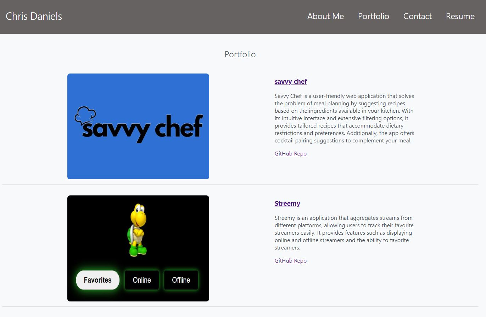

# React Portfolio
  

## Description
React Portfolio is a personal portfolio website that showcases the projects, skills, and contact information of Chris Daniels. The website is built using React and includes various sections such as About Me, Portfolio, Contact, and Resume. It provides a visually appealing and user-friendly interface.

Deployed site: https://danielschris96.github.io/react-portfolio/

## Table of Contents
* [Installation](#installation)
* [Usage](#usage)
* [License](#license)
* [Credits](#credits)

## Installation
To install dependencies, use the command `npm i`.
  
## Usage
To run the application, use the command `npm start`.  
The application will be accessible at http://localhost:3000 in your browser.

The portfolio includes the following sections:

About Me: Provides an introduction and background information about Chris Daniels. 
Portfolio: Showcases various projects undertaken by Chris Daniels, including project descriptions, live links, and GitHub repositories. 
Contact: Allows visitors to get in touch with Chris Daniels by submitting a contact form or using the provided contact information. 
Resume: Provides a link to download Chris Daniels' resume.

## License

This project is licensed under the [MIT](https://opensource.org/licenses/MIT) license.

## Credits

* [Node.js](https://nodejs.org/en/)
* [Express.js](https://expressjs.com/)
* [React](https://reactjs.org/)
* [React Icons](https://react-icons.github.io/react-icons/)